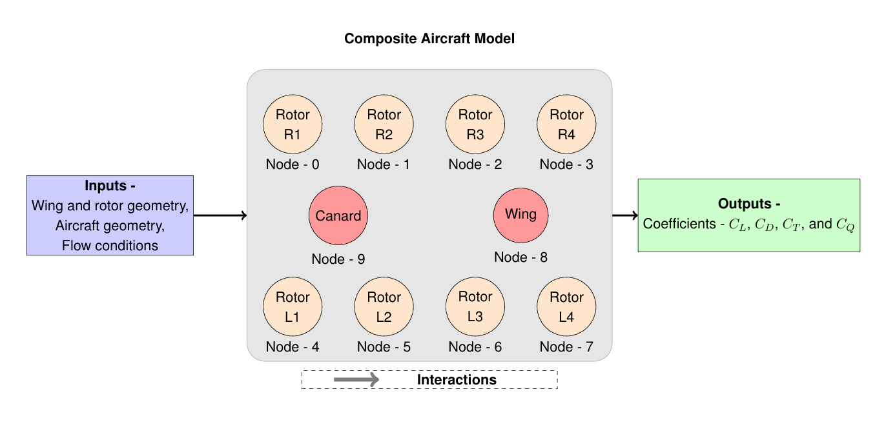

# eVTOL-VehicleModel 🚀

## Overview

The aerodynamic performance of a **multirotor eVTOL aircraft** is strongly influenced by the **complex interactions between rotors and wings**. Due to the **non-linear and unsteady nature of the flow**, traditional aerodynamic modeling approaches rely on **high-fidelity CFD simulations**, which are computationally expensive.

This repository presents a **data-driven surrogate aerodynamic model** based on **Graph Neural Networks (GNNs)** to predict the aerodynamic coefficients of aircraft components. Two distinct **graph-based architectures**—**Hierarchical** and **Recurrent**—are implemented to model the **rotor-rotor and rotor-wing interactions**. The proposed framework integrates deep learning techniques to **streamline the aerodynamic modeling process**, making it more computationally efficient for the **conceptual design phase**.

---

## Features

**Modular Aerodynamic Modeling** – Airfoil, wing, and rotor models are trained separately.  
**Graph Neural Network (GNN)** – Captures rotor-to-rotor and rotor-wing interactions.  
**Hierarchical vs. Recurrent Architectures** – Two different graph-based learning strategies.  
**CFD-Based Training Data** – Uses CFD simulation data from **FLOWUnsteady**.  
**Optimized Deep Learning Models** – CNNs, LSTMs, and GNNs tailored for aerodynamic predictions.  

---

## Models & Data

The surrogate aerodynamic model is developed in a modular way, consisting of the following components:

### **1 Airfoil Model**
- **Architecture:** Convolutional Neural Network (**CNN**)
- **Objective:** Predict lift (**Cl**) and drag (**Cd**) coefficients from airfoil coordinates.
- **Training Data:** XFOIL-based aerodynamic coefficients.

### **2 Wing & Rotor Models**
- **Architecture:** Long Short-Term Memory (**LSTM**)
- **Objective:** Predict aerodynamic performance coefficients (**Cl, Cd, Ct, Cq**) for wings and rotors.
- **Training Data:** **FLOWUnsteady** simulation results incorporating variations in **rotor speeds, angles of attack, and freestream velocity**.

### **3 Composite Model (eVTOL Aircraft)**

- **Architecture:** **Graph Neural Network (GNN)**
- **Objective:** Predict the aerodynamic coefficients of the full aircraft by integrating rotor and wing models.
- **Graph Edges:** Spatial relationships between aircraft components to model **rotor-wing and rotor-rotor interactions**.
- **Graph Architectures:**
  - **Hierarchical GNN** – Modular and interpretable training.
  - **Recurrent GNN** – Captures sequential dependencies but is computationally heavier.
- **Performance Comparison:** The **Hierarchical GNN achieves an average relative L2 error of 5%**, outperforming the recurrent model in **accuracy and computational efficiency**.

---


## Usage 

### **1 Utility Functions & Model Architectures**
- **Located in** `/src/`
- Includes Python scripts for **data processing, and model architecture**.

### **2 Jupyter Notebooks for Training & Evaluation**
- **Located in** `/notebooks/`
- Notebooks with `*_analysis.ipynb`:
  - **Load trained models** (airfoil, rotor, wing, aircraft).
  - **Plot results and performance metrics**.

### **3 Pre-trained Models & Scalers**
- **Located in** `/trained_models/`
- Contains saved models for **airfoil, wing, rotor, and composite GNN models**.

### **4 Model Performance & Results**
- **Located in** `/results/`
- Stores plots and comparisons between **Hierarchical vs. Recurrent GNN architectures**.

### **5 Training & Test Data**
- **Located in** `/data/`
- Includes the dataset used for training and evaluating the models.

---

## Installation

### **1 Prerequisites**
This system requires **Windows Subsystem for Linux (WSL)** to run properly.  
Ensure that **WSL 2** is installed and set up before proceeding.

### **2 Clone the Repository**
```bash
git clone https://github.com/ss-hegde/eVTOL-VehicleModel.git

cd eVTOL-VehicleModel

pip install -r requirements.txt
```

## Contact
For questions or feedback, reach out via:
email: sharath.hegde@tum.de


